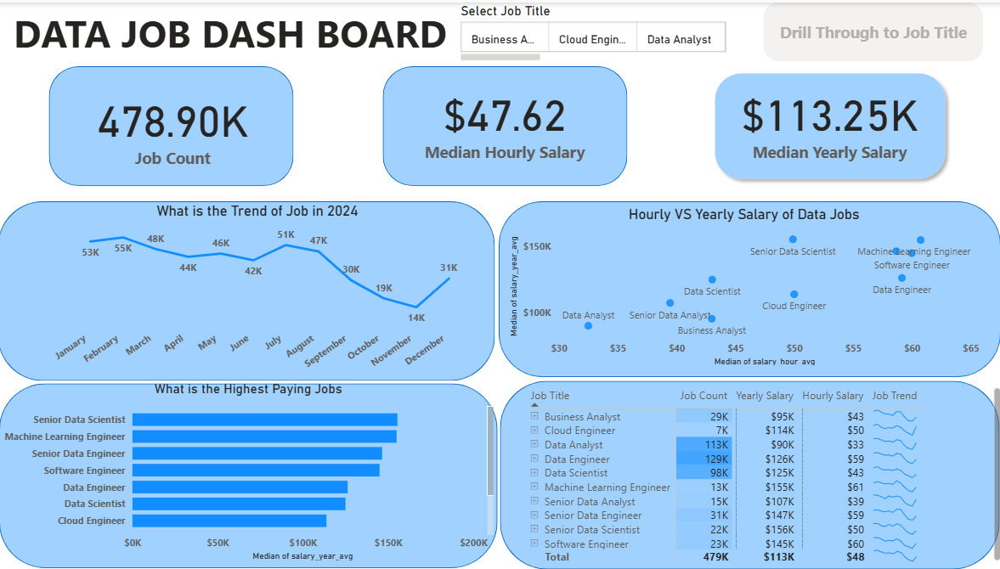
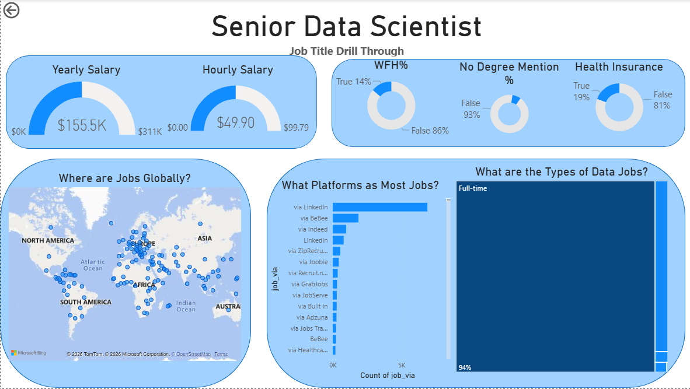

# 📖 Introduction

This project presents an interactive **Global Data Jobs Dashboard** developed using **Microsoft Power BI** to analyze worldwide data-related job opportunities. The dashboard transforms raw job posting data into meaningful business insights, enabling users to explore salary trends, hiring patterns, job roles, employment types, and geographic distribution through interactive visualizations.

The report is designed for **job seekers, aspiring data professionals, recruiters, and hiring managers** who want to better understand the current data job market. By leveraging Power Query for data transformation, DAX for calculations, and interactive dashboard design, this project provides an intuitive platform for exploring market trends and making data-driven career decisions.
---

## 💼 Skills Showcased

- **⚙️ Data Transformation (ETL) with Power Query:** Cleaned and transformed raw job posting data by handling missing values, modifying data types, and preparing the dataset for analysis.

- **🧮 DAX Calculations & Measures:** Created calculated measures and KPIs to analyze important metrics such as **Job Count**, **Median Hourly Salary**, and **Median Yearly Salary**.

- **📊 Interactive Dashboard Development:** Designed a user-friendly dashboard using KPI Cards, Line Charts, Bar Charts, Scatter Charts, Tables, Treemaps, Donut Charts, Gauge Charts, and Map Visualizations.

- **🌍 Geospatial Analysis:** Implemented Bing Maps to visualize the global distribution of data job opportunities across different countries and regions.

- **📈 Business Intelligence & Data Visualization:** Developed meaningful visualizations to identify salary trends, hiring patterns, top-paying job roles, and employment statistics.

- **🎛 Interactive Reporting:** Implemented dynamic **Slicers**, **Drill-through Pages**, and **Navigation Buttons** to provide an engaging and user-friendly analytical experience.

- **📋 KPI Reporting:** Built executive-level KPI cards and summary tables to present key business metrics in a clear and concise manner.

- **📖 Data Storytelling:** Structured the dashboard to communicate insights effectively, helping users understand the current landscape of the global data job market through visual storytelling.

---

# 📊 Dashboard Overview

---

# 📊 Page 1: Dashboard Overview

This dashboard provides a high-level overview of the global data job market through interactive visualizations and key performance indicators. It enables users to quickly identify hiring trends, salary insights, and the most in-demand data roles.

### Key Highlights

- 📌 Total Job Count
- 💰 Median Hourly Salary
- 💵 Median Yearly Salary
- 📈 Monthly Job Trend Analysis
- 📊 Highest Paying Data Job Roles
- 🔄 Hourly vs Yearly Salary Comparison
- 📋 Job Statistics Summary Table
- 🎛 Dynamic Job Title Slicer

The dashboard is designed to help users quickly understand market trends and make informed career decisions using interactive filtering and visual storytelling.

---

## 📄 Page 2: Job Title Drill-through

The Drill-through page provides a detailed analysis for each selected job title from the main dashboard. Users can navigate directly from the overview page to explore role-specific insights.

### Detailed Analysis Includes

- 💰 Median Yearly Salary
- 💵 Median Hourly Salary
- 🏠 Work From Home Percentage
- 🎓 Degree Requirement Analysis
- 🏥 Health Insurance Availability
- 🌍 Global Job Location Distribution
- 💼 Top Hiring Platforms
- 📊 Employment Type Distribution

---

# 📌 Conclusion

The **Global Data Jobs Dashboard** is an end-to-end Business Intelligence project developed using **Microsoft Power BI** to transform raw job posting data into meaningful and actionable insights.

By leveraging **Power Query** for data transformation, **DAX** for calculations, and interactive visualizations such as KPI cards, maps, slicers, and drill-through reports, the dashboard provides a comprehensive analysis of salary trends, hiring patterns, employment types, and global job opportunities.

This project demonstrates my ability to clean, model, analyze, and visualize real-world datasets while designing intuitive dashboards that support data-driven decision-making. It reflects the practical skills required for a Data Analyst role and showcases my proficiency in Business Intelligence, data visualization, and analytical storytelling.

---

# 🚀 Future Enhancements

The dashboard can be further enhanced with additional features, including:

- 🔄 Integration with real-time job market APIs for live data updates.
- 📈 Predictive salary and hiring trend analysis using Machine Learning.
- 🏢 Company-wise and industry-wise hiring analytics.
- 🌎 Advanced regional and country-level filtering.
- 📅 Historical trend comparison across multiple years.
- 📱 Mobile-optimized dashboard layout for improved accessibility.
- 🤖 AI-powered insights and automated data summaries.

---

# 👩‍💻 Author

## P. Sri Varshini

**Final Year B.Tech – Computer Science & Engineering (Data Science)**

🎯 Aspiring Data Analyst | Business Intelligence Enthusiast

### Technical Skills

- 📊 Microsoft Power BI
- 🧮 SQL
- 🐍 Python
- 📈 Microsoft Excel
- 🔄 Power Query
- 📐 DAX
- 📊 Data Visualization
- 📉 Business Intelligence
- 📋 Data Analytics
  
---

⭐ **If you found this project useful, please consider giving it a Star!**
